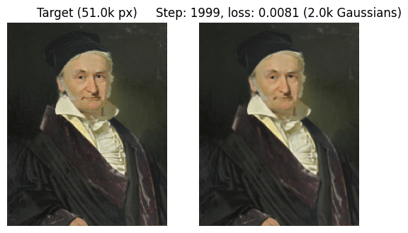

# 2DGaussianSplatting

[Video (Youtube)](https://www.youtube.com/watch?v=DLKLgWZ-BGk)

This repository contains a Jupyter Notebook (colab) that showcases how to reconstruct an image using 2D Gaussian functions with learned means, covariances and RGBA tints. It is based on the theory presented in [3D Gaussian Splatting for Real-Time Radiance Field Rendering](https://repo-sam.inria.fr/fungraph/3d-gaussian-splatting/).

Note that the purpose of the code is to only provide a bare bones version of the methodology, which omits basically all optimizations and bells & whistles. It's just for the fun of playing with this exciting technology. 